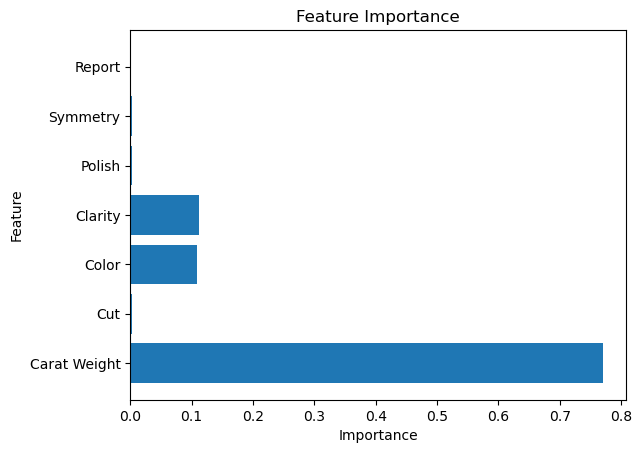

# Diamond Analysis Project

This project involves data exploration and analysis of diamond characteristics using both Excel and CSV files. The goal is to extract insights about pricing, quality, and features of diamonds, and to identify the top 5 most valuable ones.

## Project Structure

```bash
diamond-analysis-project/
├── notebooks/
│   └── diamond_analysis.ipynb              # Main analysis notebook
├── data/
│   ├── data.xlsx                           # Raw dataset
│   ├── diamond_analysis_report.xlsx        # Processed or summarized Excel report
│   └── top_5_diamonds.csv                  # Final top 5 diamonds data
├── README.md                               # Project documentation
├── requirements.txt                        # Dependencies
└── .gitignore                              # Files to exclude from Git
```

## 📊 Description

The dataset includes multiple features of diamonds, such as:
- Carat
- Cut
- Color
- Clarity
- Price
- Depth
- Table
- Dimensions

## 🔍 Goals

- Clean and explore the data
- Visualize relationships between features and price
- Identify patterns that impact diamond valuation
- Find the top 5 most expensive diamonds

## ✅ Output

Key Results:

**Model Performance:**
- Mean Absolute Error (MAE): 666.18
- R² Score: 98.5%

**Feature Importance Visualization**


The model achieved high accuracy in predicting diamond prices, enabling confident recommendations with an optimal price-to-quality ratio.

**Best Model Parameters:**
- n_estimators: 150
- max_depth: 20
- min_samples_split: 2

**Top-5 Diamond Recommendations** 
Recommendations were based on the lowest price-per-carat ratio among diamonds that met both the budget and feature preferences.
All diamonds in the top-5 list satisfy the following conditions:
- Price ≤ $3000
- Carat weight ≤ 1.0
- Cut quality: "Very Good" or "Ideal"

A final CSV file with the top 5 diamonds by value, and a structured notebook showing all analysis steps.

## ⚙️ Setup

```bash
pip install -r requirements.txt
jupyter notebook notebooks/diamond_analysis.ipynb
```

Author
Zarina Sakhipova